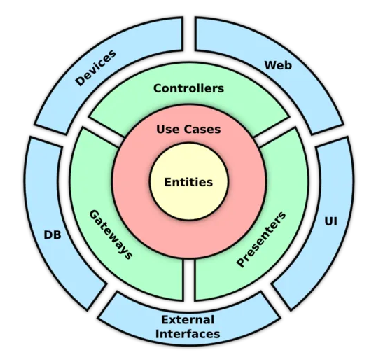
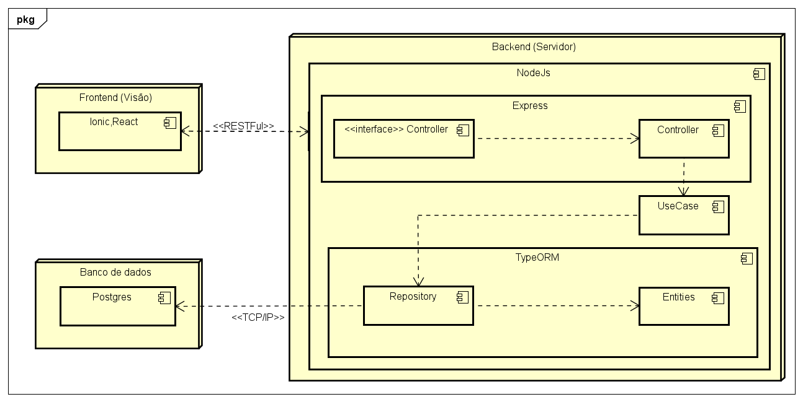
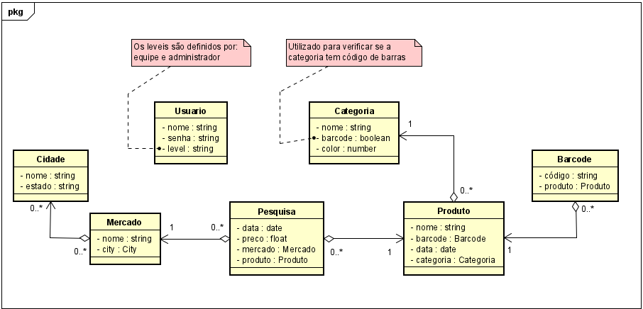
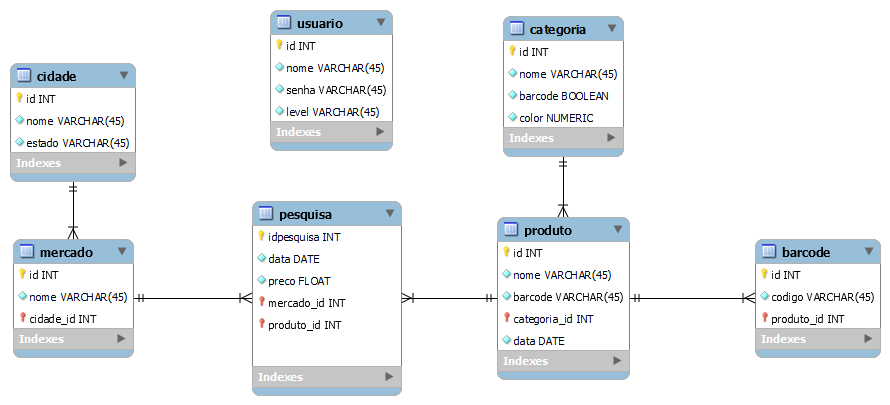

# Manual do sistema

## ESCOPO DO SISTEMA

O Sistema de Índice de Preços Jóia Ribeirinha (IPJR) é um projeto concebido para facilitar a análise e visualização dos índices de preços nos mercados da cidade de Presidente Epitácio. O IPJR compreende duas plataformas distintas: um aplicativo mobile (App) e um sistema web (Web) destinados ao cadastro e visualização dos dados relacionados aos preços dos produtos. <br>
O principal propósito do IPJR é oferecer aos seus usuários uma experiência eficiente e relevante, pautada na segurança, eficiência e organização. Para atingir este objetivo, o sistema foi delineado para atender às necessidades de diferentes tipos de usuários e suas respectivas funções.
Os usuários sem cadastro, que acessam o sistema via plataforma web, terão a capacidade de visualizar graficamente os índices de preços dos produtos, bem como os índices das categorias. Além disso, eles terão acesso à média mensal das categorias, porém, com certas limitações.
Os administradores, através do aplicativo mobile, terão controle total sobre o sistema. Suas funcionalidades abrangem o cadastramento, visualização, edição e exclusão de produtos, categorias e supermercados, além da possibilidade de realizar pesquisas em todas essas áreas.
As equipes, que também operam no aplicativo mobile, terão a capacidade de cadastrar, visualizar, editar e excluir produtos, bem como realizar pesquisas direcionadas aos produtos em questão.
Os administradores e equipes que utilizam a plataforma web possuirão as mesmas funcionalidades do aplicativo mobile, mas com um acréscimo importante: eles poderão visualizar graficamente os índices de preços dos produtos, os índices das categorias e um quadro resumo de produtos por categoria em determinados períodos. <br>
O projeto do IPJR não se encontra mais restrito à cidade de Presidente Epitácio, podendo atender outras regiões. Com o escopo ampliado, o sistema continuará a atender ás demandas de Presidente Epitácio, além de outras localidades. A segurança e confidencialidade dos dados dos usuários constituem preocupações prioritárias ao longo do desenvolvimento do sistema. O IPJR será desenvolvido de modo a ser compatível com dispositivos móveis e navegadores web modernos, visando garantir a acessibilidade e a usabilidade aos usuários.
Em resumo, o Sistema de Índice de Preços Jóia Ribeirinha (IPJR) é uma solução abrangente que visa fornecer uma ferramenta eficiente e organizada para a análise e visualização de índices de preços, priorizando a satisfação e as necessidades dos seus diversos tipos de usuários em diferentes localidades.

## REGRAS DE NEGÓCIO

### Administrador - Mobile

#### Pesquisas

- Pode cadastrar, alterar e excluir.
- Apenas pode cadastrar se:
  - A pesquisa tem um produto válido;
  - A pesquisa tem um preço válido;
  - A pesquisa tem uma categoria válida.
- Apenas pode alterar:
  - O preço de uma pesquisa.

#### Produtos

- Pode consultar, cadastrar, alterar e excluir.
- Apenas pode cadastrar se:
  - O produto tem um nome válido;
  - O produto tem uma categoria válida;
  - O produto pode ter mais de um código de barras (O código de barras é cadastrado durante o processo de pesquisa).
- Apenas pode alterar:
  - O nome do produto.
- Excluir os códigos de barras a ele atribuídos.
- Apenas pode excluir se:
  - O produto não está em uma pesquisa.

#### Categorias

- Pode consultar, cadastrar, alterar e excluir.
- Apenas pode cadastrar se:
  - A categoria tem um nome único;
  - A categoria tem ou não um código de barras (verdadeiro ou falso).
  - A categoria tem uma cor de referência (gráfico);
- Apenas pode alterar:
  - O nome da categoria;
  - Se a categoria tem ou não um código de barras (verdadeiro ou falso).
  - Cor de referência;
- Apenas pode excluir se:
  - A categoria não está relacionada a um produto.

#### Mercados

- Pode consultar, cadastrar, alterar e excluir.
- Apenas pode cadastrar se:
  - O mercado tem um nome único.
- Apenas pode alterar:
  - O nome do mercado.
- Apenas pode excluir se:
  - O mercado não está relacionado a uma pesquisa.
 
#### Cidades

- Pode consultar, cadastrar, alterar e excluir.
- Apenas pode cadastrar se:
  - A cidade tem um nome único.
- Apenas pode alterar:
  - O nome da cidade e do Estado.
- Apenas pode excluir se:
  - A cidade não está relacionado a um mercado.

#### Contas

- Pode consultar, cadastrar, alterar, excluir, sair e alterar o tema.
- Apenas pode cadastrar se:
  - O usuário tem nome único.
- Apenas pode alterar:
  - O nome do usuário;
  - A senha do usuário;
  - O nível de acesso do usuário.
- Apenas pode excluir se:
  - O usuário não é administrador.

### Administrador - Web

#### Visualizar os quadros de médias e índices mensais

- Pode consultar a média mensal por ano dos produtos:
  - Média dos produtos do açougue;
  - Média dos produtos da feirinha;
  - Média dos produtos da mercearia;
  - Média dos produtos de higiene;
  - Média dos produtos de limpeza.
- Pode consultar o índice mensal por ano dos produtos:
  - Índice dos produtos do açougue;
  - Índice dos produtos da feirinha;
  - Índice dos produtos da mercearia;
  - Índice dos produtos de higiene;
  - Índice dos produtos de limpeza.

#### Visualizar graficamente o índice de preços anual

- Pode consultar o índice mensal de cada ano por:
  - Categorias:
    - Açougue;
    - Feirinha;
    - Mercearia;
    - Higiene;
    - Limpeza.
  - Geral:
    - Índice geral de todas as categorias por mês.

### Equipe - Mobile

#### Pesquisas

- Pode cadastrar, alterar e excluir.
- Apenas pode cadastrar se:
  - A pesquisa tem um produto válido;
  - A pesquisa tem um preço válido;
  - A pesquisa tem um mercado válido.
- Apenas pode alterar:
  - O preço de uma pesquisa.

#### Produtos

- Pode consultar, cadastrar e excluir.
- Apenas pode cadastrar se:
  - O produto tem um nome válido;
  - O produto tem uma categoria válida;
  - O produto pode ter mais de um código de barras (O código de barras é cadastrado durante o processo de pesquisa).
- Excluir os códigos de barras a ele atribuídos.
- Apenas pode excluir se:
  - O produto não está em uma pesquisa.

#### Conta

- Pode consultar, sair e alterar o tema.

### Equipe - Web

#### Visualizar os quadros de médias e índices mensais

- Pode consultar a média mensal por ano dos produtos:
  - Média dos produtos do açougue;
  - Média dos produtos da feirinha;
  - Média dos produtos da mercearia;
  - Média dos produtos de higiene;
  - Média dos produtos de limpeza;
  - E outras cadastradas;
- Pode consultar o índice mensal por ano dos produtos:
  - Índice dos produtos do açougue;
  - Índice dos produtos da feirinha;
  - Índice dos produtos da mercearia;
  - Índice dos produtos de higiene;
  - Índice dos produtos de limpeza;
  - E outras cadastradas;

#### Visualizar graficamente o índice de preços anual

- Pode consultar o índice mensal de cada ano por:
  - Categorias:
    - Açougue;
    - Feirinha;
    - Mercearia;
    - Higiene;
    - Limpeza.
    - E outras cadastradas;
  - Geral:
    - Índice geral de todas as categorias por mês.

### Usuário sem cadastro - Web

#### Visualizar graficamente o índice de preços anual

- Pode consultar o índice mensal de cada ano por:
  - Categorias:
    - Açougue;
    - Feirinha;
    - Mercearia;
    - Higiene;
    - Limpeza.
    - E outras cadastradas;
  - Geral:
    - Índice geral de todas as categorias por mês.

## ARQUITETURA LÓGICA DO SISTEMA

```bash
clean-architecture-node-express
├── src
│   ├── entities
│   ├── use_cases
│   ├── interfaces
│   │   ├── controllers
│   │   ├── repositories
│   │   └── adapters
│   └── frameworks
└──     └── express
```

A Clean Architecture tem como objetivo principal criar sistemas desacoplados e independentes de frameworks e bibliotecas externas. Ela divide o sistema em camadas concêntricas, onde cada camada depende apenas das camadas mais internas. Essas camadas são:

1. Entidades: Representam os objetos de negócio e as regras de negócio que não dependem de detalhes externos.
2. Casos de Uso: Orquestram as regras de negócio e coordenam o fluxo de dados entre as entidades e os detalhes externos.
3. Adaptadores de Interface: Fazem a conversão entre os formatos de dados utilizados pelas entidades e os formatos exigidos pelos detalhes externos.
4. Detalhes Externos: Incluem frameworks, bibliotecas, bancos de dados e outras fontes externas com as quais o sistema interage.



## ARQUITETURA DE IMPLANTAÇÃO DO SISTEMA



## DIAGRAMA DE CLASSES



## MODELO LÓGICO DO BANCO DE DADOS


